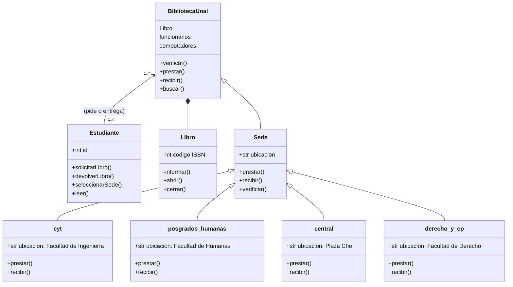

```mermaid
classDiagram


    class BibliotecaUnal {
        Libro
        funcionarios
        computadores
        +verificar()
        +prestar()
        +recibir()
        +buscar()
    }


    class Estudiante {
        +int id
        +solicitarLibro()
        +devolverLibro()
        +seleccionarSede()
        +leer()
    }


    class Libro {
        -int codigo ISBN
        -informar()
        +abrir()
        +cerrar()
    }


    class Sede {
        +str ubicacion
        +prestar()
        +recibir()
        +verificar()
    }


    class cyt {
        +str ubicacion: Facultad de Ingeniería
        +prestar()
        +recibir()
    }


    class posgrados_humanas {
        +str ubicacion: Facultad de Humanas
        +prestar()
        +recibir()
    }


    class central {
        +str ubicacion: Plaza Che
        +prestar()
        +recibir()
    }


    class derecho_y_cp {
        +str ubicacion: Facultad de Derecho
        +prestar()
        +recibir()
    }


    BibliotecaUnal "1..*" <-- "1..n" Estudiante : (pide o entrega)
    BibliotecaUnal *-- Libro
    BibliotecaUnal <|-- Sede
    Sede <|-- cyt
    Sede <|-- posgrados_humanas
    Sede <|-- central
    Sede <|-- derecho_y_cp
```

